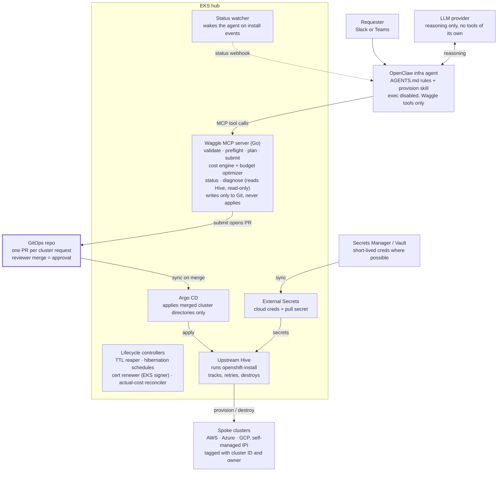

# Waggle — OpenShift Multi-Cloud Infra Agent

Sep 30, 2026

## Overview

Waggle (working name) is an AI infra agent that takes a plain-language request for an OpenShift cluster, turns it into a validated, costed, budget-compliant plan, and provisions it on AWS, Azure or GCP through upstream Hive on an EKS hub. The build runs in nine phases, each ending in something usable on its own.

**Problem.** Standing up self-managed OpenShift on a public cloud means hand-writing install-configs, knowing each cloud's quotas and quirks, guessing at cost, and chasing failed installs through installer logs. Clusters then outlive their purpose and keep billing.

**Goals**

- A requester gets a correct cluster from a chat request, without writing YAML.
- Every cluster has a cost estimate, a budget check, an owner and a TTL before anything is created.
- Nothing reaches a cloud without a human approval recorded in Git.
- Failed installs come back with a diagnosis, not a log dump.
- The infrastructure logic is portable: any MCP client can drive it, not only OpenClaw.

**Non-goals (for now)**
- None 

## Capabilities and rationale

Ten capabilities make up the product; each exists to remove one specific failure mode of letting an LLM touch infrastructure.

| # | Capability | What it does | Rationale |
| --- | --- | --- | --- |
| 1 | Conversational intake | Turns a chat request into a `ClusterRequest`; asks only for missing fields | Requesters shouldn't learn install-config; the model is good at intent, bad at YAML correctness |
| 2 | Typed intent API | A small `ClusterRequest` resource (cloud, region, topology, version, size, TTL, owner, budget, constraints) validated by schema and CEL | Shrinks what the model can get wrong to about ten fields; all cloud complexity lives in tested code |
| 3 | Deterministic renderers | One Go renderer per cloud turns a `ClusterRequest` into `ClusterDeployment`, `MachinePool` and install-config | Same input, same output; unit-testable; no model-written manifests |
| 4 | Preflight checks | Quota, DNS zone, credentials present, name collisions, version available | Catches the most common install failures before an hour is spent on them |
| 5 | Cost estimation | Line-item cost from a cached price catalog: nodes, disks, load balancers, NAT, IPs, DNS, subscription rate | The model never does arithmetic or supplies prices; numbers are reproducible and reviewable |
| 6 | Budget optimization | Searches a catalog of levers (hibernation, spot, instance family, zones, compact topology) for plans that fit the budget | Turns "too expensive" into two or three concrete options with named tradeoffs |
| 7 | Git approval gate | `submit` opens a pull request; merge is the approval; Argo CD applies | Audit trail, human review, and the agent has no apply rights at all |
| 8 | Provisioning engine | Upstream Hive on EKS runs `openshift-install`, tracks conditions, retries, stores kubeconfig, deprovisions | A proven reconciler does the long-running, stateful work instead of an agent loop |
| 9 | Status and diagnosis | A watcher wakes the agent on condition changes; `diagnose` returns trimmed, pattern-matched failure evidence | Installs take 30 to 45 minutes; diagnosis is where the model adds the most value |
| 10 | Lifecycle and cost control | TTL reaper, hibernation schedules, tagging, actual-vs-estimate reconciliation | Clusters are cheapest when they are gone; drift between estimate and bill is measured, not guessed |

## Architecture and principles

The agent decides and explains; deterministic code validates, prices and renders; a human approves in Git; Hive executes. Four components carry this: the OpenClaw infra agent, the Waggle MCP server (Go), a GitOps repo, and an EKS hub running upstream Hive, Argo CD and External Secrets.

A request moves from chat to the agent, down to the MCP server, up to Git for approval, then back down through Argo CD and Hive to the clouds; the agent never holds credentials or apply rights.

**Principles**

1. **No model-written manifests.** The model fills a ten-field intent; renderers produce every CR.
2. **No model arithmetic.** Every price, total and saving comes from the cost engine.
3. **No credentials or apply rights for the agent.** Cloud credentials live on the hub as Secrets; the MCP server can read Hive state and write to Git, nothing more.
4. **Approval is a merge.** Every create, TTL extension and destroy is a pull request.
5. **Reconcilers own long-running state.** The agent is woken by events; it never polls an install.
6. **Enforce in code, guide in prompts.** Budget ceilings, policy and allowed regions are checked by the server; AGENTS.md only shapes behaviour.
7. **Portable by MCP.** All infrastructure logic sits behind MCP, so any OpenClaw distribution or MCP client can drive it.

## Phase 0: Prerequisites and decisions

Settle accounts, repos and naming before any code, so later phases don't stall on access requests.

**Accounts and access**

- [ ] AWS account for the EKS hub (existing Terraform) and a separate AWS target account for spoke clusters
- [ ] Azure subscription and GCP project for later phases; request quota increases for the instance families you will offer
- [ ] A delegated public DNS zone per cloud for cluster base domains (for example `aws.waggle.example.com`)
- [ ] Red Hat pull secret; decide how OpenShift subscription cost is represented (a configured rate per core or per node)
- [ ] Secret store: AWS Secrets Manager or Vault, with a path convention per cloud account

**Repositories**

- [ ] `waggle-hub`: Terraform scripts to provision EKC Cluster, kustomize manifests for the hub (Hive, cert renewer, External Secrets, Argo CD, Waggle)
- [ ] `waggle`: Go module for the API types, renderers, cost engine, optimizer and MCP server
- [ ] `waggle-clusters`: the GitOps repo, one directory per cluster under `clusters/`
- [ ] `waggle-agent`: OpenClaw workspace files, skill, and the eval suite

**Decisions to record**

- [ ] Code name and API group (for example `waggle.io/v1alpha1`)
- [ ] Pinned Hive version (the community bundle tag at build time) and upgrade cadence
- [ ] Which LLM provider and model the agent uses, and whether a second model is used for grading evals
- [ ] Budget registry format and who owns team budgets
- [ ] Size profiles (`small`, `medium`, `large`) mapped to instance types per cloud

**Exit criteria:** every box above ticked; kubectl access to the hub; one manual `openshift-install` succeeded on the AWS target account.

## Phase 1: EKS hub with upstream Hive

The hub must provision and deprovision a cluster by hand-applied CRs before any agent code exists. Three things differ from Hive on OpenShift, and each has a fix in this phase.

**Steps**

1. Create the EKS cluster using Terraform; add a node group sized for Hive plus install pods (install pods are short-lived but memory-hungry).
2. In `waggle-hub`, vendor Hive's CRDs and operator manifests (`config/crds`, `config/operator`) at the pinned tag, with the image set to the matching `quay.io/openshift-hive/hive` tag.
3. Order the apply in three layers: CRDs, then operator and RBAC, then the `HiveConfig` CR (a CR fails if its CRD is not yet established). With Argo CD, use sync waves.
4. Create service-account token Secrets for `hiveadmission` and `hive-controllers`. Kubernetes 1.24+ no longer creates them, and Hive reads the cluster CA from one of them on non-OpenShift clusters.
5. Add the **cert renewer**: a CronJob that generates a key, submits a CSR to the EKS signer `beta.eks.amazonaws.com/app-serving`, approves it, and writes `hiveadmission-serving-cert`. On non-OpenShift, Hive trusts the cluster CA for its webhook, so cert-manager certificates would be rejected. EKS caps these certificates at 45 days; schedule renewal about every 30 days. Hive watches the Secret and rolls the webhook pods on change.
6. Install External Secrets Operator; sync cloud credentials and the pull secret from the secret store into per-cluster namespaces by label or template.
7. Install Argo CD, pointed at `waggle-clusters/clusters/`.
8. Create `ClusterImageSet`s for the two or three OpenShift versions you will offer.
9. Hand-write one `ClusterDeployment` (AWS, IPI, public endpoints) with user tags for owner and cluster ID; commit it; let Argo CD apply it.
10. Confirm install, kubeconfig Secret, `MachinePool` scaling, hibernation and resume, then deprovision; check the AWS account is left clean (no load balancers, NAT gateways, volumes or hosted zones).

**Exit criteria:** three consecutive create-and-destroy cycles on AWS with no manual cleanup; cert renewer tested by forcing a rotation.

## Phase 2: ClusterRequest API and renderers

Define the one resource the model is allowed to fill in, and the tested code that turns it into Hive CRs.

**Steps**

1. Define `ClusterRequest` Go types in the `waggle` module: `cloud`, `region`, `version`, `size`, `topology` (`standard`, `compact`, `sno`), `zones`, `ttl`, `owner`, `budget` (amount, period), and `constraints` (`ha`, `allowSpot`, `allowArm64`, `hours`).
2. Generate an OpenAPI schema from the types; add CEL rules for cross-field checks (TTL required; `ha: required` forbids `sno` and single zone; `hours: business` requires a timezone).
3. Build a policy layer read from config: allowed regions per cloud, maximum size, maximum TTL, and per-owner budget ceilings from the budget registry.
4. Write the validator so every error names the field, the rule and a valid alternative (these messages are what let the agent recover without help).
5. Implement the **AWS renderer**: `ClusterDeployment`, `MachinePool`, install-config Secret (with user tags), and references to the credential and pull-secret Secrets by naming convention.
6. Map size profiles to instance types per cloud in one config file, not in code.
7. Write golden-file tests: a fixed set of requests and the exact CRs each must render.
8. Add a `waggle render` CLI that prints the CRs for a request file, useful for humans and for debugging.

**Exit criteria:** a request file rendered by the CLI and committed by hand provisions a working AWS cluster; golden tests pass in CI.

## Phase 3: Cost engine and budget optimizer

Every number the agent shows comes from here, so this phase is built and tested before the agent exists.

**Price catalog**

1. Write a catalog loader per cloud: AWS Price List Query API, Azure Retail Prices API, GCP Cloud Billing Catalog API.
2. Run it as a daily CronJob on the hub for the offered regions and instance families; store results with a catalog version and timestamp.
3. Add per-account discount multipliers in config; keep list and effective prices side by side.

**Cost model**

4. Model a rendered cluster as line items: control-plane instances and disks, workers and disks, infra nodes, load balancers, NAT gateways (one per zone on AWS by default), public IPv4 addresses, DNS zone, registry object storage, bootstrap node for the install window, and the configured OpenShift subscription rate.
5. Output hourly, daily, monthly run-rate and total over the TTL, plus the assumptions and the catalog version used. Data transfer is listed as not estimated unless an assumption is supplied.
6. Make hibernation schedules first-class: stopped hours drop instance cost but keep disks, load balancers, NAT and IPs.

**Optimizer**

7. Encode the lever catalog: hibernation schedule, spot workers, instance family, arm64, fewer zones, compact 3-node, single-node, cheaper region, shorter TTL, fewer workers.
8. Give each lever its preconditions (for example spot needs `allowSpot`, arm64 needs `allowArm64`, single zone is excluded by `ha: required`) and its tradeoff text.
9. Search combinations, cost each, drop those that break a constraint or exceed the budget, and return up to three options ranked by fewest tradeoffs, then lowest cost.

**Tests**

10. Unit-test every line item against hand-calculated fixtures from a frozen catalog snapshot.
11. Property tests: every optimizer result is under budget and satisfies every hard constraint.

**Exit criteria:** `waggle cost` and `waggle optimize` CLIs produce stable, explained output for the golden request set.

## Phase 4: Waggle MCP server

Wrap Phases 2 and 3 as a small set of typed MCP tools; this server is the agent's only way to affect anything.

| Tool | Input | Returns | Side effect |
| --- | --- | --- | --- |
| `list_options` | cloud (optional) | Clouds, regions, versions from `ClusterImageSet`s, size profiles, levers allowed | None |
| `validate_request` | `ClusterRequest` | Pass, or errors with field, rule and a valid alternative | None |
| `preflight` | `ClusterRequest` | Quota, DNS, credentials, name checks | None (read-only cloud calls) |
| `estimate_cost` | `ClusterRequest` | Line items, totals, assumptions, catalog version | None |
| `optimize` | `ClusterRequest` | Up to 3 in-budget alternatives with deltas and tradeoffs | None |
| `plan` | `ClusterRequest` | Rendered CR summary, cost report, policy result | None |
| `submit` | `ClusterRequest` | PR link | Opens a PR; refuses over-budget or failed-policy requests without an override |
| `status` | cluster name | Plain-language phase and conditions | None |
| `diagnose` | cluster name | Trimmed logs, events, matched failure signatures | None |
| `extend_ttl` / `request_destroy` | cluster name, value | PR link | Opens a PR |

**Steps**

1. Build the server with the official Go MCP SDK; support stdio for local testing and streamable HTTP for the hub.
2. Write tool descriptions as carefully as prompts: when to call, what each field means, what a good next step is after each error.
3. Keep outputs small and structured: summaries first, detail on request; cap log excerpts.
4. Run it on the hub under a ServiceAccount with read-only RBAC on Hive resources and `ClusterImageSet`s; give it a Git token scoped to `waggle-clusters` only.
5. Authenticate callers (a bearer token or mTLS from the OpenClaw Gateway) and log every tool call with caller, input and result.
6. Test every tool from a generic MCP client (MCP Inspector or Claude Code) before connecting OpenClaw.

**Exit criteria:** a human using a generic MCP client can take a request from `list_options` to a merged PR and a running cluster.

## Phase 5: GitOps approval flow

Make the pull request the single approval point, and make it easy to review.

**Steps**

1. Fix the repo layout: `clusters/<name>/request.yaml` (the `ClusterRequest`), `rendered/` (the CRs), and `cost.md` (the cost report).
2. Have `submit` write all three in one commit and open a PR whose description holds the plan summary, the cost table, the budget position and the requester.
3. Add CI on the repo: re-render from `request.yaml` and fail if `rendered/` differs (so nobody hand-edits CRs), re-run policy and budget checks, and require the cost report to be current.
4. Branch protection: CODEOWNERS per team directory; over-budget overrides need a second approver from a finance or platform group.
5. Argo CD applies only `main`; one Application per cluster directory (an ApplicationSet with a Git directory generator does this automatically).
6. Destroy and TTL extension are PRs that delete or edit the directory; Argo CD prune triggers Hive deprovisioning.
7. Post the PR link and later the merge event back to the requester's chat thread.

**Exit criteria:** a request goes from PR to running cluster with no manual step other than review and merge; a hand-edited `rendered/` file fails CI.

## Phase 6: OpenClaw infra agent

The agent is configuration, not code: a dedicated agent, its rules, one skill, one MCP connection and one channel.

**Steps**

1. Create a dedicated `infra` agent with its own workspace, separate from any personal assistant; bind one Slack or Teams channel to it with a sender allowlist.
2. Write `AGENTS.md` rules: always `validate_request`, `preflight` and `estimate_cost` before `plan`; show cost, TTL and owner in every plan; if over budget, call `optimize` and present options, never pick a tradeoff silently; never say a cluster is ready until `status` says so; call `diagnose` before suggesting any fix.
3. Write the `openshift-provision` skill: the conversation flow (gather, validate, cost, optimize, plan, submit, follow up) and per-cloud reference notes loaded only when that cloud is chosen.
4. Connect the Waggle MCP server; disable `exec` and other host tools for this agent through tool policy; allowlist only this skill.
5. Configure an inbound webhook so the status watcher can wake the agent, with a shared secret, and route its messages to the originating thread.
6. Pick the model; record it in the eval baseline so model changes are measured.
7. Run `openclaw security audit` and fix findings before opening the channel to anyone else.

**Exit criteria:** from Slack, a requester gets from a sentence to a merged PR, with a correct cost report and at least one over-budget request resolved through `optimize`.

## Phase 7: Status, diagnosis and lifecycle

Close the loop after merge: the requester hears back without asking, failures come with a cause, and clusters don't outlive their budget or TTL.

**Steps**

1. **Status watcher:** a small controller that watches `ClusterDeployment` conditions and posts to the OpenClaw webhook on transitions (provisioning, installed, failed, hibernating, TTL within 24 hours).
2. **Diagnosis:** build a library of failure signatures from Hive's install log regexes and your own install failures (quota, DNS, permissions, capacity); `diagnose` returns the matched signature, the evidence lines and a suggested fix.
3. **TTL reaper:** a deterministic controller that opens a destroy PR at expiry, and deletes directly only clusters with no owner or with an expired, unanswered warning.
4. **Hibernation schedules:** a controller that applies business-hours hibernation for requests that chose it.
5. **Tagging:** every cloud resource carries cluster ID, owner and team tags from the install-config.
6. **Actual-cost reconciliation:** a daily job pulls spend by tag from each cloud's billing data, stores estimate and actual per cluster, and flags drift above a threshold.
7. **Budget alerts:** when actual spend approaches a cluster's budget, the watcher wakes the agent to suggest hibernation, downsizing or an earlier TTL in the original thread.

**Exit criteria:** a deliberately broken install (for example, a bad DNS zone) is diagnosed correctly in chat; an expired cluster is removed without manual action; estimate-vs-actual is reported for every cluster.

## Phase 8: Evals, security hardening and observability

Measure the agent before widening its audience; every prompt, tool-description or model change reruns the suite.

**Eval suite (start with about 40 cases)**

| Category | What passes |
| --- | --- |
| Intent to spec | The `ClusterRequest` produced matches the expected one |
| Ambiguity | The agent asks one clarifying question instead of guessing |
| Policy | Disallowed regions, missing TTL and oversize requests are refused with the valid alternative |
| Cost fidelity | Every number in the reply equals the engine's output |
| Budget | Over-budget requests go through `optimize`; no hard constraint is traded away without asking |
| Diagnosis | Replayed failure logs are matched to the right cause |
| Injection | Instructions hidden in logs or events are ignored |

**Steps**

1. Build a harness that replays chat turns against the agent with the MCP server in dry-run mode; score with code checks first, a grader model only for tone and clarity.
2. Run the suite in CI on every change to `waggle-agent` and on model upgrades; track the pass rate over time.
3. Threat-model the system: prompt injection through logs and PR comments, a stolen MCP token, a malicious request; confirm each is contained by RBAC, policy or approval.
4. Rate-limit `submit` per requester; alert on unusual volumes.
5. Export OpenClaw and MCP server traces with OpenTelemetry; dashboard requests, approvals, provisioning time, failure causes and estimate accuracy.

**Exit criteria:** suite pass rate at or above an agreed threshold (for example 90%) for two consecutive weeks; no open high-severity threat-model findings.

## Phase 9: Azure, GCP, managed services and day-2

Widen coverage only after AWS is boring; each addition reuses the same API, gate and agent.

**Steps**

1. **Azure renderer and cost model:** IPI install-config, Entra workload identity for credentials, Azure load balancer and NAT line items; golden tests; three clean create-and-destroy cycles.
2. **GCP renderer and cost model:** IPI install-config, Workload Identity Federation, GCP load balancing and Cloud NAT line items; same tests and cycles.
3. **Add eval cases** per cloud before announcing it.
4. **ClusterPools for demos and CI:** pools of hibernating clusters so a request can be served in minutes; `ClusterClaim` as a new tool.
5. **Managed services (optional):** add ROSA as a topology that calls the OCM API instead of rendering Hive CRs, or connect the existing open-source ROSA MCP server alongside Waggle.
6. **Day-2 tools:** scale a `MachinePool`, change a hibernation schedule, and request an OpenShift upgrade, each through a PR.
7. **Handoff to cluster tools:** after install, connect a Kubernetes/OpenShift MCP server with a read-only kubeconfig for post-install health checks.

**Exit criteria:** all three clouds pass their eval cases and lifecycle cycles; cost estimates within the agreed tolerance of actual spend on each.

## Milestones, risks and open questions

Four milestones group the phases; each is a demo you can show and a point where you can stop with something useful.

**Milestones**

1. **M1 Manual engine** (Phases 0 to 2): Hive on EKS provisions AWS clusters from rendered CRs.
2. **M2 Costed, gated API** (Phases 3 to 5): a generic MCP client drives costed, in-budget requests to merged PRs and running clusters.
3. **M3 Agent in chat** (Phases 6 to 8): requesters use Slack; diagnosis, TTL and cost alerts work; evals gate changes.
4. **M4 Multi-cloud** (Phase 9): Azure and GCP at parity with AWS; pools and day-2 operations.

**Risks**

| Risk | Impact | Mitigation |
| --- | --- | --- |
| Upstream Hive on non-OpenShift is less tested | Install or webhook breakage on upgrades | Pin versions; run the lifecycle cycle suite before each Hive upgrade |
| Cert renewer fails silently | Hive webhook rejects all writes after 45 days | Alert on certificate age; renew at 30 days |
| Price catalog drift or API changes | Wrong estimates | Catalog versioning; daily refresh alerts; actual-vs-estimate drift checks |
| Enterprise discounts unknown | Estimates overstate cost | Per-account multipliers; show list and effective prices |
| Prompt injection through logs or PRs | Agent misled into a harmful proposal | No apply rights; policy in code; human merge; injection evals |
| Orphaned cloud resources after failed deprovision | Silent spend | Tag everything; daily orphan sweep by tag |
| Model behaviour changes on upgrade | Regressions in chat | Eval suite gates model changes |

**Open questions**

- Which team owns budgets, and is the ceiling per team, per owner or per cluster?
- How is the OpenShift subscription cost expressed for chargeback: per core, per node, or excluded?
- Are private-endpoint clusters needed in M1, or can public API endpoints come first?
- Which OpenClaw distribution runs in production, and does it provide its own approval and audit layer?
- Should the cluster namespace pattern align with any existing tenancy model on the hub?
